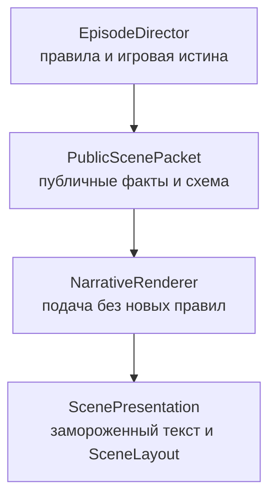

# Narrative v0.4: спецификация повествовательного слоя

Статус: `0.4-draft`, только проектирование и сценарный тест до ворот `NG1`.
Документ не разрешает изменение production-механики, подключение LLM в runtime,
разработку Telegram или 3D-интерфейса.

## 1. Проверяемая гипотеза

Статический консольный v0.3 корректно исполняет правила, но воспринимается как
последовательность меню и таблиц. Ручной narrative-прототип показал более сильное
вовлечение, когда те же типы решений были представлены через пространство,
персонажей, неизвестность и наблюдаемые последствия.

Новая гипотеза:

> Детерминированные правила остаются источником истины, а отдельный
> повествовательный слой превращает разрешённые публичные факты в ясную живую
> сцену, не меняя правил и исходов.

## 2. Источник истины на текущем этапе

До `NG1` новый сценарий не реализуется существующим Java-кодом. Единственным
нормативным источником его правил является заранее замороженный
`FrozenScenarioGraph`:

```text
FrozenScenarioGraph
- scenarioVersion
- initialPublicState
- initialHiddenState
- packetDefinitions
- transitionTable
- riskCases
- terminalStates
```

Не вмешивающийся ведущий только находит строку перехода по текущему `packetId`,
`choiceId` и назначенному тестовому случаю риска, а затем дословно показывает
указанный `ScenePresentation`. Он не объясняет сцену, не выбирает последствия и
не дописывает текст.

После успешных ворот `NG1` тот же замороженный граф может быть реализован через
`EpisodeDirector`. До этого `EpisodeDirector` остаётся источником истины только
для уже реализованного «Кислотного фронта».

## 3. Разделение ответственности после реализации



После реализации `EpisodeDirector` становится единственным игровым мастером в
смысле правил.
Название `NarrativeRenderer` выбрано намеренно: компонент не выбирает события и
не импровизирует игровую истину.

## 4. Концептуальный контракт PublicScenePacket

Это ещё не нормативный Java API. До разрешения реализации контракт фиксируется
на уровне данных:

```text
PublicScenePacket
- scenarioVersion
- contentVersion
- packetId
- sceneId
- stateFingerprint
- publicWorldState
- sceneLayout
- presentCharacters
- confirmedFacts
- unresolvedQuestions
- priorPublicConsequences
- availableChoices
- optionalRiskPreview
- terminology
- styleConstraints
```

### publicWorldState

Содержит только показатели, которые игрок уже знает и которые имеют значение в
текущей сцене: люди, пища, оставшиеся часы энергии, детали, доступность машин,
отношения и активные угрозы. Панель одной сцены показывает не более семи строк.

### sceneLayout

Явно задаёт:

- устойчивые пространственные узлы;
- связи и расстояния между ними;
- текущее местоположение людей, машин и угроз;
- закрытые, известные и недоступные маршруты;
- изменение схемы после предыдущего решения.

Повествователь не может добавлять новый тоннель, комнату, персонажа или объект,
если его нет в `sceneLayout` и публичных фактах.

### confirmedFacts и unresolvedQuestions

`confirmedFacts` — проверенные игроком сведения. `unresolvedQuestions` — только
объявленная неизвестность. Неизвестность не является разрешением придумывать
произвольный поворот после выбора.

### availableChoices

Каждое решение содержит стабильный ID, естественное действие, известные
непосредственные последствия, источник риска и границы допустимого
перефразирования. `NarrativeRenderer` не добавляет, не удаляет и не объединяет
решения.

Каждый `packetId` однозначно соответствует одному публичному состоянию. Разные
скрытые состояния могут разделять пакет только тогда, когда они дают одинаковые
публичные факты, решения, риск и presentation.
`stateFingerprint` вычисляется только из публичного состояния, используется для
аудита и не показывается участнику.

## 5. Концептуальный контракт ScenePresentation

```text
ScenePresentation
- presentationId
- packetId
- contentVersion
- locale
- title
- orientationMap
- orientationText
- statePanel
- narrativeBody
- dialogueLines
- confirmedFactsText
- unresolvedQuestionsText
- choiceTexts
- optionalRiskResult
- optionalCausalRecap
```

До пригодных тестовых сессий все presentations замораживаются вместе с версией и
SHA-256 сценарного пакета. Повторное открытие одного `packetId` не должно
показывать другую географию, реплики или объяснение уже произошедшего результата.

## 6. Обязательная структура сцены

1. Показать, где находятся база, цель, люди и машины.
2. Показать только значимые сейчас показатели состояния.
3. Представить один непосредственный конфликт.
4. Дать реакцию максимум двух-трёх персонажей с различимыми позициями.
5. Разделить подтверждённое и неизвестное.
6. Предложить от двух до четырёх естественно сформулированных решений. Свободный
   приказ не используется в тесте `NG1`.
7. После результата показать событие, затем короткую причинную сводку.

Если местоположение изменилось, новая сцена обязана обновить карту до
повествовательного текста.

## 7. Ограничения ясности

- Не более одного нового фантастического понятия за сцену.
- Новое понятие сначала объясняется одной простой фразой, затем получает имя.
- Пространственная схема содержит не более семи узлов.
- В одной сцене участвуют не более трёх говорящих персонажей.
- Один абзац описывает одно наблюдаемое изменение.
- Технический enum, outcome ID и внутренний score не попадают в текст.
- Название системы пишется как «Хор», а не `ХОР` или `XOR`.
- Причинная сводка содержит не более пяти звеньев.
- Не использовать неопределённые местоимения «там», «они», «это», если в сцене
  присутствуют несколько возможных объектов.

## 8. Границы повествовательной свободы

Повествователь может:

- выбирать конкретные, но заранее разрешённые формулировки;
- распределять публичные факты между описанием и репликами;
- выражать зафиксированную реакцию персонажа его голосом;
- связывать последовательные публичные последствия в короткую сцену;
- сокращать повторяющееся объяснение, не меняя смысл.

Повествователь не может:

- читать `HiddenWorldState` до разрешённого раскрытия;
- назначать бросок, модификатор или исход;
- менять ресурсы, местоположение и состояние персонажей;
- обещать последствие, которого нет в решении;
- создавать нового персонажа, предмет, угрозу или маршрут;
- объявлять выбор морально правильным;
- превращать неудачу в тупик или отменять принятую цену;
- самостоятельно продолжать сюжет после терминального состояния.

## 9. Персонажи и реакции

Персонаж не является названием бонуса. Для каждой значимой фигуры фиксируются:

- роль и компетенция;
- текущая цель;
- страх или граница, через которую он не хочет переступать;
- отношение к игроку и другим персонажам;
- разрешённые реакции на конкретные публичные события;
- факты, которые персонаж знает и не знает.

Реакция возникает из события. Потеря машины или человека не может завершиться
только изменением состояния: хотя бы один присутствующий персонаж либо сама
машина должны наблюдаемо отреагировать.

## 10. Случайность

Бросок допустим, только если каждый диапазон создаёт различимую сцену:

- `<= 6` — новое осложнение и изменение следующего решения;
- `7–9` — достижение цели с наблюдаемой ценой;
- `>= 10` — преимущество, открывающее или упрощающее следующий ход.

Недостаточно изменить скрытый флаг или строку эпилога. Источник риска
показывается до решения, а результат — сначала как событие и только затем как
числа кубиков и причинная цепочка.

В тесте `NG1` используются три заранее назначенных случая с модификатором `0`:
`2+3`, `3+4` и `5+5`. Они покрывают три полосы без случайного перекоса маленькой
выборки. Назначение случая скрыто от участника до броска и фиксируется до начала
сессии. Это исследовательская балансировка теста, а не правило будущей игры.
Узел проверки достижим на каждом полном пути, иначе назначенные случаи нельзя
сопоставить трём пригодным сессиям.

## 11. Стратегическая читаемость

Перед значимым решением игрок видит фактический горизонт критических ресурсов:
часы энергии, дни пищи и доступные детали. Слово «полная» не заменяет число
оставшихся часов старого генератора.

Доктрина допустима только тогда, когда игрок заранее знает исполнимые правила
каждого приказа и может вывести хотя бы класс возможной цены. Доктрина не должна
быть проверкой знания скрытой таблицы.

## 12. Варианты реализации после следующего ворот

Рассматривается гибрид:

- автор и движок задают факты, правила, решения и реакции;
- LLM при необходимости используется только как проверяемый renderer текста;
- результат валидируется по структуре и замораживается;
- для каждой сцены существует авторский fallback;
- при ошибке renderer игра показывает fallback, а не изменяет состояние.

Подключение LLM, внешнего API или сети не разрешено этим документом. Сначала
необходимо проверить замороженный сценарий и контракт на людях.

## 13. Критерий готовности к реализации

До production-кода должны существовать:

1. один полностью замороженный неканонический исследовательский сценарий из 5–7
   сцен;
2. не более 20 `PublicScenePacket` для всех достижимых публичных состояний;
3. авторский `ScenePresentation` для каждого пакета;
4. пространственная схема каждой сцены;
5. четыре терминальных семейства; отдельные terminal packets разрешены, если
   их публичные физические состояния различаются; не более 24 полных путей;
6. проверка отсутствия скрытых фактов, новых решений и непокрытых переходов;
7. один технический пилот, после него не более одной правки формулировок и
   заморозка версии с внешне записанным SHA-256 пакета либо утверждённым Git
   commit SHA; контрольная сумма не записывается внутрь самих хешируемых файлов;
8. три пригодных сценарных прохождения с не вмешивающимся ведущим;
9. отдельное решение владельца об открытии `NG1` и выборе authored или hybrid
   renderer.
